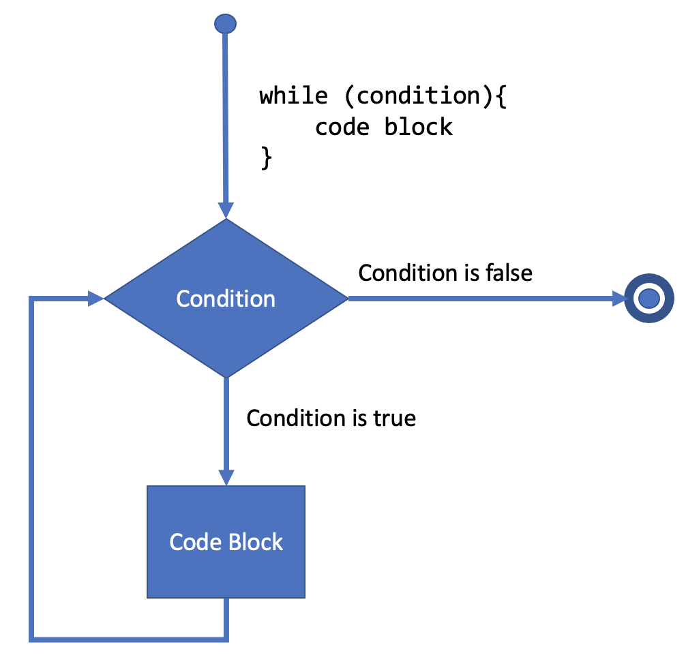
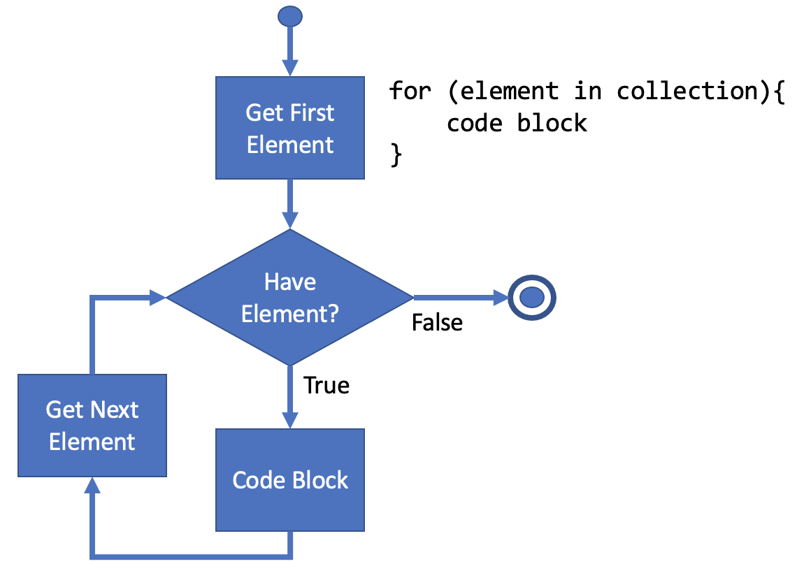

# Introduction to R programming

R is a scripting language and environment primarily designed for statistical computing and graphics.  R is an extended and free implementation of the S programming language.  R provides a wide variety of statistical (e.g., linear and nonlinear modelling, classical statistical tests, time-series analysis, classification, clustering) and graphical techniques, and is highly extensible.  As a scripting language, R does not need to be compiled into machine code for it to run.  R scripts are run on demand by the R interpreter.

## R scripts versus R notebooks

R scripts (files with the .R extension) are text files that define objects, functions, data, read and write data (input and output (I/O)) and flow control. If you print an R file then the reader can't see what it generated without having to run it themselves and capture the results.

An R Markdown document is *knitted* in a fresh R environment to create another file (or set of files) that mixes input and output with the rendered markdown to create publishable files (e.g., HTML, PDF). An R Notebook is an interactive version of an R Markdown document.  It is best to run code chunks in order from top to bottom. You *can* run code chunks out of order in an R Notebook, though that can cause problems later, so it is strongly discouraged.

## Basic arithmetic with R

### Addition

Add two numerics.

```{r}
22 + 7
```

### Subtraction

Subtract two numerics.

```{r}
22 - 7
```

### Multiplication

Multiply two numerics.

```{r}
22 * 7
```

### Division

Divide two numerics.

```{r}
22 / 7
```

### Exponents

Raise a numeric by a power of another numeric.

```{r}
22 ^ 7
# square root computed via exponent
16 ^ 0.5
```

### Order of operations

In math, the *order of operations* are the rules that state the sequence in which the multiple operations in an expression should be solved.

A way to remember the order of the operations is **PEMDAS**, where in each letter stands for a mathematical operation.

**P**arentheses - The first step is to solve all the operations within the parentheses, from the inside to out.  The R operator here of course is a pair of parentheses ().

**E**xponent - Compute all the exponential expressions. The R operator for raising a number to a power is caret ^.

**M**ultiplication and **D**ivision - Next, moving from left to right, multiply and/or divide whichever comes first.  The R operator for multiplication is asterisk *, and for division is slash /.

**A**ddition and **S**ubtraction - Lastly, moving from left to right, add and/or subtract whichever comes first.  The R operator for addition is plus +, and for subtraction is minus -.

```{r}
11 * 2 + 14 / 2
```

Using parentheses helps improve readability (even when they are not strictly necessary).

```{r}
(11 * 2) + (14 / 2)
```

Use parentheses to change the order of operations.

```{r}
11 * (2 + 14) / 2
```

## Variables

Use the <- character combination to assign an object to a variable. Note how it looks like an arrow pointing from the object to the variable name.

```{r}
# Use number sign or hashtag for comments
variable.name <- 22 / 7
```

Two common ways to print the variable (also check the Environment tab in RStudio):

```{r}
# Let's print the variable
variable.name
```

or

```{r}
print(variable.name)
```

### Working with variables

Variables are named objects.

A variable is created the moment you first assign a value to it. To assign a value to a variable, use the <- sign. To output (or print) the variable value, just type the variable name.  R does not have a command for declaring a variable.

In other programming languages, it is common to use = as the assignment operator. In R, we can use =, <-, and -> (uncommon) as assignment operators.

However, <- **is preferred** in most cases because the = operator can be forbidden in some contexts in R.

We can use variables together and work with them.

```{r}
bank.account <- 1000
```

Variable assignment can be on the left or the right in R, just change the direction of the assignment arrow.  Note that although this completely *legal*, it is not very typical.

```{r}
# this is the same as deposit -> 10
100 -> deposit
```
```{r}
bank.account <- bank.account + deposit
bank.account
```

## Basic data types in R

### Numerics

Decimal numbers (floating point values) are part of the numeric class in R.

```{r}
n <- 3.14
n
```

### Integers

Natural (whole) numbers are known as integers and are also part of the numeric class.

```{r}
i <- 7
i
```

### Complex

Complex numbers have both real and imaginary parts.

```{r}
cplx <- 4 + as.complex(-4) ^ 0.5
cplx
```

### Logical

Boolean values (True and False) are part of the logical class. In R these are written in *All Caps* as either TRUE or T and FALSE or F, for true and false, respectively.

```{r}
t <- TRUE
t
```

```{r}
f <- F
f
```

### Characters

Text/string values are known as characters in R. You use quotation marks (can be double or single) to create a text character string.

```{r}
chars <- "Hello World!"
chars
```

```{r}
# Also single quotes work
c <- 'Single Quote Char'
c
```

### Checking Data Type Classes

You can use the **class()** function to check the data type of a variable:

```{r}
class(t)
```

```{r}
class(f)
```

```{r}
class(cplx)
```

```{r}
class(c)
```

```{r}
class(chars)
```

```{r}
class(i)
```

```{r}
class(n)
```

## Collections

### Vectors

Vectors are one of the key data structures in R which we will be using. A vector is a 1-dimensional array that can hold character, numeric, or logical data elements.

#### Vector Basics

Create vectors using the *combine function* c(). To use the function, we pass in the elements we want in the vector, with each individual element separated by a comma.

Let's see some examples:

```{r}
# Using c() to create a vector of numeric elements
nvec <- c(1, 2, 3, 4, 5)
class(nvec)
```

```{r}
# Vector of characters
cvec <- c('A', 'B', 'C', 'Delta')
cvec
```

```{r}
class(cvec)
```

```{r}
lvec <- c(TRUE, FALSE)
lvec
```

```{r}
class(lvec)
```

Note that we *cannot mix data types of the elements in a vector*, R will convert the other elements in the vector to force everything to be of the same data type. Later on, we will learn about the list data structure that can handle multiple data types!

Here's a quick example of what happens with arrays given different data types:

```{r}
v <- c(TRUE, FALSE, 2)
v
```

```{r}
class(v)
```

```{r}
v <-c(FALSE, T, 2, "pi", 3.14)
v
```

```{r}
class(v)
```

#### Vector Names

We can use the names() function to assign names to each element in our vector. For example, imagine the following vector of a week of temperatures:

```{r}
temps <- c(72, 71, 68, 73, 69, 75, 73)
temps
```

We know we have 7 temperatures for 7 weekdays, but which temperature corresponds to which weekday? Does it start on Monday, Sunday, or another day of the week? This is where names() can be assigned in the following manner:

```{r}
names(temps) <- c('Sun', 'Mon', 'Tue', 'Wed', 'Thu', 'Fri', 'Sat')
```

Now note what happens when we display the named vector:

```{r}
temps
```

We can now begin to see how the elements were assigned names! Depending on what IDE you are using, you may see the above displayed horizontally instead of vertically, that's totally fine!

We also don't have to rewrite the names vector over and over again, we can use simple use a variable name as a names() assignment, for example:

```{r}
days.of.week <- c('Sun', 'Mon', 'Tue', 'Wed', 'Thu', 'Fri', 'Sat')
temps2 <- c(1, 2, 3, 4, 5, 6, 7)
names(temps2) <- days.of.week
temps2
```

#### Working with Vectors

We can perform basics arithmetic with vectors and operations will occur on an element-by-element basis, for example:

```{r}
v1 <- c(1,2,3)
v2 <- c(5,6,7)
```

##### Adding Vectors

```{r}
v1 + v2
```

##### Subtracting Vectors

```{r}
# subtracting a vector from itself creates a vector of zeros
v1 - v1
```
```{r}
v1 - v2
```

##### Multiplying Vectors

```{r}
v1 * v2
```

##### Dividing Vectors

```{r}
v1 / v2
```

##### Vector math using a scalar

```{r}
v1 + 7
```

```{r}
# Remember the order of operations (PEMDAS)
3 + v1 ^ 2 * 3 - 1
```

##### Vector wrapping

If the longer vector length is not a multiple of the shorter vector length, R will warn you, but the calculations will "wrap around" using the shorter vector.

```{r}
# v3 is longer than v1 and is not a multiple of the length of v1
v3 <- c(1,2,3,4,5)
v1 / c(1,2,3,4,5)
```

##### Using functions with vectors

Let's learn about a few useful built-in functions that we can use with vectors. A function will be in the form:
name_of_function(input)

We will learn about creating our own functions later, but R comes with lots of built-in functions that you will commonly use.

For example, if you want to sum all the elements in a numeric vector, you can use the **sum()** function:

```{r}
v1
sum(v1)
```

We can also compute things like the standard deviation, variance, maximum element, minimum element, and product of elements:

```{r}
v <- c(12,45,100,2)
# Standard Deviation
sd(v)
```

```{r}
#Variance
var(v)
```

```{r}
# Maximum Element
max(v)
```

```{r}
#Minimum Element
min(v)
```

```{r}
# Product of elements
prod(v1)
prod(v2)
```

This is far from all the built-in functions available in R! Use this [short R Reference Card](https://cran.r-project.org/doc/contrib/Short-refcard.pdf) for all the available built-in functions.

#### Vector Indexing and Slicing

You can use bracket notation to index and access individual elements from a vector:

```{r}
v1 <- c(100,200,300)
v2 <- c('a','b','c')
```

```{r}
v1
v2
```

Indexing works by using brackets and passing the index position of the element as a number. Keep in mind that in R, the index starts at 1 (in many other programming languages indexing starts at 0).

```{r}
# Grab second element
v1[2]
```

```{r}
v2[2]
```

##### Multiple Indexing

We can grab multiple items from a vector by passing a vector of index positions inside of the square brackets.

```{r}
v1[c(1,2)]
```

```{r}
v2[c(2,3)]
```

```{r}
v2[c(1,3)]
```

##### Slicing

You can use a colon (:) to indicate the beginning and the ending of the index to extract a contiguous piece from a vector. The format is:

```
vector[start_index:stop_index]
```

and you will get that "slice" of the vector returned to you. For example:

```{r}
v <- c(1,2,3,4,5,6,7,8,9,10)
v[2:4]
```

```{r}
v[7:10]
```

Notice how the elements in both the starting index and the stopping index are included.

##### Indexing with Names

We've previously seen how we can assign names to the elements in a vector, for example:

```{r}
v <- c(1,2,3,4)
names(v) <- c('a','b','c','d')
```

We can use those names along with the indexing brackets to grab individual elements from the array!

```{r}
v['a']
```

Or pass in a vector of names we want to grab:

```{r}
# Notice how we can extract elements out of order!
v[c('a','c','b')]
```

##### Comparison Operators and Selection

As alluded to in the comparison operator lecture, we can use comparison operators to filter out elements from a vector. Sometimes this is referred to as boolean/logical masking because you are creating a vector of logicals to filter out results you want. Let's see an example of this:

```{r}
v
```

```{r}
v[v>2]
```

Let's break this down to see how it works, we first get the vector v>2:

```{r}
v>2
```

Now we basically pass this vector of logicals through the brackets of the vector and only extract true values at the matching index positions:

```{r}
v[v>2]
```

We could also assign names to these logical vectors and pass these in as well.

```{r}
my_filter <- v>2
my_filter
```

```{r}
v[my_filter]
```

### Matrices

### Creating a Matrix from Vectors
Vectors allow us to store indexed elements. A matrix will allow us to have a 2-dimensional data structure which, like a vector, contains elements consisting of the same data type.

Before diving into the Matrix, let's look into a quick way to create sequential numeric vectors using the colon notation from slicing:

```{r}
1:10
```

```{r}
v <- 1:10
v
```

Now, to create a matrix in R, pass a vector into the matrix() function.

```{r}
matrix(v)
```

Notice how the output is displayed. Here we have a two-dimensional matrix which is 10 rows by 1 column. Now what if we want to specify the number of rows? We can pass the parameter/argument into the matrix function called nrow which stands for number of rows.

```{r}
matrix(v,nrow=2)
```

Now we have a 2 by 5 matrix. Notice that the nrow argument allows this to happen. But how do we decide the fill order? We could have filed columns first (as we did above) or filled out the rows first in sequential order. The byrow argument allows you to specify whether you want to fill out the matrix by rows or by columns.

```{r}
matrix(1:12,byrow = FALSE, nrow=4)
```

```{r}
matrix(1:12, byrow=TRUE, nrow=4)
```

We can combine vectors to later input them into a matrix. For example, imagine the following vectors below of stock prices:

```{r}
# not real prices
goog <- c(450,451,452,445,468)
msft <- c(230,231,232,236,228)
```

```{r}
stocks <- c(goog, msft)
```

```{r}
stock.matrix <- matrix(stocks, byrow=TRUE, nrow=2)
stock.matrix
```

#### Naming Matrices

Now that we have our matrix, it would be nice to name the rows and columns for reference. We can do this similarly to the names() function for vectors, but in this case we define colnames() and rownames().

```{r}
weekdays <- c('Mon', 'Tue', 'Wed', 'Thu', 'Fri')
stock.names <- c('GOOG', 'MSFT')
```

```{r}
colnames(stock.matrix) <- weekdays
rownames(stock.matrix) <- stock.names
stock.matrix
```

We are starting to build up something powerful here. It's beginning to feel a bit like a spreadsheet!

#### Matrix operations

We can perform functions across the columns and rows, such as colSum.

```{r}
colSums(stock.matrix)
```

```{r}
# Doesn't really make sense for stocks, but just to show how it works
rowSums(stock.matrix)
```

We can also do other mathematical operations, check this [reference](https://cran.r-project.org/doc/contrib/Short-refcard.pdf) for all the functions that are available.

```{r}
rowMeans(stock.matrix)
```

#### Binding columns and rows to an existing matrix

Let's go ahead and see how we can add columns and rows to a matrix, we can use the cbind() function to bind a new column, and the rbind() function to bind a new row. For example, let's bind a new row with (fake) Facebook stock prices.

```{r}
FB <- c(111,112,113,120,145)
```

```{r}
tech.stocks <- rbind(stock.matrix, FB)
tech.stocks
```

Now let's add an average column to the matrix:

```{r}
avg <- rowMeans(tech.stocks)
avg
```

```{r}
tech.stocks <- cbind(tech.stocks, avg)
tech.stocks
```

#### Matrix Selection and Indexing

Just like with vectors, we use the square bracket notation to select elements from a matrix. Since we have two dimensions to work with, we'll use a comma to separate our indexing for each dimension.

The syntax is:

```
example.matrix[rows, columns]
```

where the index notation (e.g., 1:5) is put in place of the rows or columns. If either rows or columns is left blank, then we are selecting all the rows or all the columns.

```{r}
mat <- matrix(1:50, byrow=TRUE, nrow=5)
mat
```

```{r}
# Grab first row
mat[1,]
```

```{r}
#Grab first column
mat[,1]
```

```{r}
# Grab first 3 rows
mat[1:3,]
```

```{r}
# Grab top left rectangle of:
# 1,2,3
# 11,12,13
#
mat[1:2,1:3]
```

```{r}
# Grab last two columns
mat[,9:10]
```

```{r}
# Grab a center square of:
# 15,16
# 25,26
mat[2:3,5:6]
```

#### Matrix Arithmetic

We can perform element by element mathematical operations on a matrix with a scalar (single number) just like we could with vectors.

```{r}
mat <- matrix(1:50, byrow=TRUE, nrow=5)
mat
```

```{r}
# Multiplication
2*mat
```

```{r}
# Division (reciprocal)
1/mat
```

```{r}
# Division
mat/2
```

```{r}
# Power
mat ^ 2
```

#### Comparison operators with matrices

We can similarly perform comparison operations across an entire matrix to return a matrix of logicals:

```{r}
mat > 17
```

#### Matrix Arithmetic with multiple matrices

We can use multiple matrices with arithmetic as well, for example:

```{r}
mat + mat
```

```{r}
mat / mat
```

```{r}
# Warning, big numbers!
mat ^ mat
```

```{r}
# arithmetic multiplication element by element
mat * mat
```

#### Matrix multiplication

A quick side-note on matrix multiplications. You can perform arithmetic multiplication on an element-by-element basis using the * sign in R. You should note this is *not* the same as [Matrix Multiplication](https://en.wikipedia.org/wiki/Matrix_multiplication). If you are familiar with the mathematics behind this topic and want to use R to perform *true* matrix multiplication, you can use the **%*%** operator:

```{r}
mat2 <- matrix(1:9, nrow=3)
mat2
```

```{r}
# True Matrix Multiplication
mat2 %*% mat2
```

#### Factor and Categorical Matrices

Understanding the **factor()** function will be necessary when applying data analysis and machine learning techniques to our data.

Let's start by showing an example of why and how we build these matrices. Imagine we have the following vectors representing data from an animal sanctuary for dogs ('d') and cats ('c') where they each have a corresponding id number in another vector.

```{r}
animal <- c('d','c','d','c','c')
id <- 1:length(animal)
```

Note that we used a function called **length()** to calculate the length of the animal vector.  If the length of the animal vector changes, then so will the id vector.  This is a good practice because it means that if something changes in the data (and it will), that we don't need to change much (if any) of the code to facilitate the change.

We want to convert the animal vector into information that an algorithm or equation can understand more easily. Meaning we want to begin to check how many categories (factor levels) are in our character vector.
We can pass the vector through the **factor()** function like so to get this information:

```{r}
factor.ani <- factor(animal)
factor.ani
```

We can see that we have two levels, 'd' and 'c'. In R there are two distinct types of categorical variables, a **ordinal categorical variable**, and a **nominal categorical variable**.

Nominal categorical variables don't have any order, such as dogs and cats (there is no order to them). Versus Ordinal categorical variables (as the name implies) do have an order. Let's take a look at ordinal categorical variables.

```{r}
ord.cat <- c('cold', 'med', 'hot')
ord.cat
```

You could begin to assign to these variables, such that:

```
cold < med < hot
```

if you wanted to assign an order while using the factor() function, you can pass in the arguments **ordered=True** and the pass in the **levels=** and pass in a vector *in the order you want the levels to be in*.

```{r}
temps <- c('cold', 'med', 'cold', 'med', 'hot', 'hot', 'cold')
fact.temp <- factor(temps, ordered=TRUE, levels=c('cold','med','hot'))
fact.temp
```

This information is useful when used along with the **summary()** function which is an amazingly convenient function for quickly getting information from a matrix or vector.

```{r}
summary(temps)
```

```{r}
summary(fact.temp)
```

### Data frames

We've learned about vectors and their two-dimensional counterpart, matrices. Now we will learn about data frames, one of the main tools for data analysis with R.  Matrix inputs were limited because all the data inside of the matrix had to be of the same data type (numerics, logicals, etc).  With data frames we will be able to organize and mix data types to create a very powerful data structure.

#### Built-in data frames

R has built in data frames for quick reference to play around with. Check out the following data frames that are built-in!

```{r}
# data frame about states
state.x77
```

```{r}
# US personal expense
USPersonalExpenditure
```

```{r}
# Women
women
```

To get a list of all available built-in data frames, use **data()**.

```{r}
data()
```

### Working with data Frames

You'll notice the states data frame was really big, we can use the **head()** and **tail()** functions to view the first and last 6 rows respectively.

```{r}
# Quick variable assignment to save typing
states <- state.x77
head(states)
```

```{r}
tail(states)
```

#### Data frames structure and data summary

We can use the **str()** function to get the structure of a data frame, which gives information on the structure of the data frame and the data it contains, such as variable names and data types. We can use **summary()** to get a quick statistical summary of all the columns of a data frame, depending on the data, this may or may not be useful!

```{r}
# Structure of Data
str(states)
```

```{r}
# Statistical summary of data
summary(states)
```

#### Creating Data frames

A quick note some people write DataFrame as one word, but in R its more commonly written as two words: data frame. Not a very huge deal either way, but if someone writes DataFrame they could be referring to a Python/pandas DataFrame, so keep that in mind!

We can create data frames using the **data.frame()** function and pass vectors as arguments, which will then convert the vectors into columns of the data frame. Let's see a simple example:

```{r}
# Some totally made-up weather data
days <- c('mon','tue','wed','thu','fri')
temp <- c(22.2,21,23,24.3,25)
rain <- c(TRUE, TRUE, FALSE, FALSE, TRUE)

# Pass in the vectors:
df <- data.frame(days, temp, rain)
df
```

```{r}
# Check structure
str(df)
```

```{r}
# Sumarize the data frame
summary(df)
```

#### Data Frame Selection and Indexing

We can use the same bracket notation we used for matrices:

```
df[rows, columns]
```

```{r}
# Everything from first row
df[1,]
```

```{r}
#Everything from first column
df[,1]
```

```{r}
# Grab Friday data
df[5,]
```

#### Selecting using column names

Here is where data frames become very powerful, we can use column names to select data for the columns instead of having to remember numbers.

```{r}
# All rain values
df[,'rain']
```

```{r}
# First 5 rows for days and temps
df[1:5,c('days', 'temp')]
```

If you want all the values of a particular column you can use the dollar sign directly after the data frame as follows:

```
df.name$column.name
```

```{r}
df$rain
```

```{r}
df$days
```

```{r}
df['rain']
```

```{r}
df['days']
```

#### Filtering with a subset condition

We can use the **subset()** function to grab a subset of values from our data frame based off some condition. For example, if we wanted to grab only the days where it rained (where rain is True).

```{r}
subset(df, subset=rain==TRUE)
```

Notice how the condition uses some sort of comparison operator, in the above case ==. Let's grab days where the temperature was greater than 23.

```{r}
subset(df, subset=temp>23)
```

Another thing to note is that we didn't pass in the column name as a character string, subset knows that you are referring to a column in that data frame.

#### Odering a Data Frame

We can sort the order of our data frame by using the order function. You pass in the column you want to sort by into the **order()** function, then you use that vector to select from the data frame.

```{r}
sorted.temp <- order(df['temp'])
df[sorted.temp,]
```

Let's take a closer look at what sorted.temp actually is.

```{r}
sorted.temp
```

Ok, so we are just asking for those index elements in that order (by default, order is ascending, we can pass a negative sign to do descending order instead).

```{r}
df[order(-df['temp']),]
```

We could have also used the other column selection method.

```{r}
df[order(df$temp),]
```

### Lists

Lists will allow us to store a variety of data structures in a single variable. This means we could store a vector, matrix, data frame, and other object types in a single list.

```{r}
# Create a vector
v <- c(1,2,3,4,5)

# Create a matrix
m <- matrix(1:10,nrow=2)

# Create a data frame
df <- women
```

```{r}
v
```

```{r}
m
```

```{r}
df
```

#### List creation

We can use the **list()** function to combine all the data structures.

```{r}
li <- list(v, m, df)
li
```

Notice that the list() assigned numbers to each of the objects in the list, but we can also assign names.

```{r}
li <- list(sample_vec = v, sample_mat = m, sample_df = df)
li
```

#### Selecting objects from a list

Use bracket notation to show objects in a list, and double brackets to grab the objects form the list.

```{r}
# Single brackets
li[1] # By index
```

```{r}
# By name
li['sample_vec']
```

```{r}
# Notice the type!
class(li['sample_vec'])
```

```{r}
# Use double brackets to grab the items
li[['sample_vec']]
```

```{r}
# Can also use $ notation
li$sample_vec
```

You can also index on top of this once you've selected the object from the list.

```{r}
li[['sample_vec']][1] # Second set of indexing
```

```{r}
li[['sample_mat']]
```

```{r}
li[['sample_mat']][1,]
```

```{r}
li[['sample_mat']][1:2,1:2]
```

```{r}
li[['sample_df']]['height']
```

#### Combining lists

Lists can even hold other lists! You can combine lists using the combine function c().

```{r}
double_list <- c(li, li)
double_list
```

```{r}
str(double_list)
```

## Logical Operators

Logical Operators will allow us to combine multiple comparison operators. The logical operators we will learn about are:

- AND - &
- OR - |
- NOT - !

The best way to explain these is to see some examples.

```{r}
# Imagine the variable x
x <- 10
```

Now we want to know if 10 is less than 20 AND greater than 5:

```{r}
x < 20
```

```{r}
x > 5
```

### AND - &

```{r}
x < 20 & x > 5
```

We can also add parenthesis for readability and to make sure the order of comparisons is what we expect:

```{r}
(x < 20) & (x>5)
```

```{r}
(x < 20) & (x>5) & (x == 10)
```

We can basically think of this as a series of Logical Boolean values, TRUE & TRUE & TRUE. We return a single TRUE if they are all TRUE. Let's see an example of this not being the case:

```{r}
x==2 & x > 1
```

Returned FALSE because while x > 1 is TRUE, we need BOTH to be TRUE, thus the AND statement &.

### OR - |

What if we only want one of them to be true? That's when we use OR |. For example:

```{r}
x==2 | x > 1
```

Here we only need one or the other to be true!

```{r}
x==1 | x==12
```

### NOT !

You can think about NOT as reversing any logical value in front of it, basically asking, "Is this NOT true?" For example:

```{r}
(10==1)
```

```{r}
!(10==1)
```

```{r}
# We can stack them (uncommon, but possible)
!!(10==1)
```

### Using logical operations for data filtering

Here's a quick example of a real use case for these operators. Let's look at the mtcars built-in data frame.

```{r}
df <- mtcars
df
```

Let's grab only those models with at least 20 mpg.

```{r}
df[df['mpg'] >= 20,] # Notice the use of indexing with the comma
# subset(df,mpg>=20) # Could also use subset
```

By combining filters with logical operators, we can select rows with cars having at least 20mpg and that are over 100hp.

```{r}
df[(df['mpg'] >= 20) & (df['hp'] > 100),]
```

### Logical Operators with Vectors

We have two options when use logical operators, a comparison of the entire vector, element by element, or just a comparison of just the first elements in the vectors, to make sure the output is a single Logical value.

```{r}
tf <- c(TRUE, FALSE)
tt <- c(TRUE, TRUE)
ft <- c(FALSE, TRUE)
tt & tf
```

```{r}
tt | tf
```

To compare only the first elements use && or ||.

```{r}
ft && tt
```

```{r}
tt && tf
```

```{r}
tt || tf
```

```{r}
tt || ft
```

## Program flow

### if, else, else if

Now it is time to finally start learning how we can program some sort of flow control logic using R! Our first step will be simple **if**, **else**, and **else if** statements.

#### if

Here is the syntax for an if statement in R:

```
if (condition) {
    # Only when the condition is TRUE, execute this code between the braces ({})
}
```

This construct allows us to implement flow control logic in our programming.  Only when the given condition is true then execute the code inside of the braces.  Note that in R, the condition *must* be wrapped in parentheses () or you'll get a syntax error when you run the code.

Suppose we have two variables, **hot** and **temp**. Imagine that **hot** starts off as FALSE and **temp** is some number in degrees Fahrenheit. If the **temp** is greater than 80 than we want to assign **hot==TRUE**, otherwise **hot** should remain **FALSE**.

```{r}
hot <- FALSE
temp <- 60

if (temp > 80) {
    hot <- TRUE
}

hot
```

```{r}
# Reset temp to something above 80 degrees
temp <- 100

if (temp > 80) {
    hot <- TRUE
}

hot
```

Something to keep in mind is that you should format your code carefully so you (or someone else) can come back later and easily read it! By convention we align the closing bracket with the if statement it refers to. However, because we use brackets (unlike python), we could be sloppy (bad practice!) and still have the code work out.

```{r}
if( 1 == 1){        print('hi')}
```

```{r}
# This works...but hard to read and your collaborators will not be pleased with this code!
if(1 ==   1)

{

    print(  'hi')

             }

```

A good editor like RStudio will help you make sure everything is aligned reasonably well.

#### else

If we want to execute another block that occurs if the **if** statement is false, we can use an **else** statement to do this! It has the syntax:

```
if (condition) {
  # Code to execute if true
} else {
  # Code to execute if above was not true
}
```

Notice the alignment of the curly brackets and the use of the **else** keyword. Let's see it in action!

```{r}
temp <- 30

if (temp > 90) {
    print("Hot outside!")
} else {
    print("Its not too hot today!")
}
```

#### else if

What if we wanted more options to print out, rather than just two, the if and the else? This is where we can use the else if statement to add multiple condition checks, using **else** at the end to execute code if none of our conditions match up with any previous **if** or **else if** in the same construct.

```{r}
temp <- 30

if (temp > 80) {
    print("Hot outside!")
} else if(temp<80 & temp>50) {
    print('Nice outside!')
} else if(temp < 50 & temp > 32) {
    print("Its cooler outside!")
} else {
    print("Its really cold outside!")
}
```

```{r}
temp <- 75

if (temp > 80) {
    print("Hot outside!")
} else if(temp < 80 & temp > 50) {
    print('Nice outside!')
} else if(temp < 50 & temp > 32) {
    print("Its cooler outside!")
} else{
    print("Its really cold outside!")
}
```

Let's try a slightly more elaborate example of **if**, **else**, and **else if**.  Imagine that we have a video game store with Xbox and PlayStation units for sale and we want a daily automated report to go to HQ depending on how many units we sell.

```{r}
# Items sold that day (hopefully read from the store's point of sale devices)
xbox <- 10
playstation <- 10

# Report to HQ
report <- 'ERROR: No report!'

if(xbox >= 10 & playstation >= 10) {
    report <- "Strong sales of both units today!"
} else if (xbox == 0 & playstation == 0) {
    report <- "No units sold today!"
} else {
    report <- 'We had some sales today.'
}
print(report)
```

### Loops

#### while loops



**while** loops are a way to have your program continuously run some block of code until a condition becomes false. The syntax is:

```
while (condition){
    # Code executed here 
    # while condition is true
}
```

A major concern when working with a **while** loop is to make sure that *at some point the condition should become false* so that the loop finishes, otherwise the **while** loop will go on forever.

Remember you can use **Crtl-C** to kill a process in RStudio if something happens to run amok.

Here's a quick side note on printing variables with strings so we can use it to demonstrate **while** loops:

```{r}
print('Just a string')
```

```{r}
var <- 'a variable'
cat('My variable is: ',var)
```

```{r}
var <- 25
cat('My number is:',var)
```

```{r}
# Could also use:
print(paste0("Variable is: ", var))
```

We'll be using the concatentation **cat()** function in the next example to demonstrate how a **while** loop works.

```{r}
x <- 0

while(x < 10){
    
    cat('x is currently: ',x)
    print(' x is still less than 10, adding 1 to x')
    
    # add one to x
    x <- x+1
}
```

Let's add an **if** statement to this logic.

```{r}
x <- 0

while(x < 10){
    
    cat('x is currently: ',x)
    print(' x is still less than 10, adding 1 to x')
    
    # add one to x
    x <- x+1
    if(x==10){
        print("x is equal to 10! Terminating loop")
    }
}
```

#### break

You can use **break** to break out of any loop (**while** and **for** loops). Previously we showed an if statement checking for 10, but this *wasn't actually stopping* the loop, the while condition check on the next run stopped the loop, let's show an example where we could use break to immediately terminate the loop:

```{r}
x <- 0

while(x < 10){
    
    cat('x is currently: ',x)
    print(' x is still less than 10, adding 1 to x')
    
    # add one to x
    x <- x+1
    if(x==10){
        print("x is equal to 10!")
        print("I will also print, woohoo!")
    }
}
```

```{r}
x <- 0

while (x < 10){
    
    cat('x is currently: ',x)
    print(' x is still less than 10, adding 1 to x')
    
    # add one to x
    x <- x+1
    if(x==10){
        print("x is equal to 10!")
        break
        # this code will never run
        print("I will also print, woohoo!")
    }
}
```

Notice how the break stopped the `"I will also print, woohoo!"` from occurring. You can use this as an internal check inside a loop to stop based off some other condition.

#### for loops



A for loop allows us to iterate over an object (such as a vector) and we can then perform and execute blocks of codes for every loop we go through. The syntax for a for loop is:

```
for (temporary_variable in object){
    # Execute some code at every loop
}
```

##### For loop over a vector

We can think of looping through a vector in two different ways, the first way would be to create a temporary variable with the use of the in keyword:

```{r}
vec <- 1:10
vec
```

```{r}
for(temp_var in vec){
    print(temp_var)
}
```

The other way would be to loop a numbered amount of times and then use indexing to continually grab from the vector:

```{r}
for (i in 1:length(vec)){
    print(vec[i])
}
```

##### For loop over a list

We can do the same thing with a list:

```{r}
li <- list(1:10)
li
```

```{r}
for (temp_var in li){
    print(temp_var)
}
```

```{r}
for(i in 1:length(li)){
    print(li[[i]]) # Remember to use double brackets here!
}
```

##### For loop with a matrix

We can similarly loop through each individual element in a matrix:

```{r}
mat <- matrix(1:25,nrow=5)
mat
```

```{r}
for (num in mat){
    print(num)
}
```

##### Nested for loops

We can nest **for** loops inside one another; however, be careful when doing this as every additional for loop nested inside another may cause a significant amount of additional time for your code to finish executing.

```{r}
for (row in 1:nrow(mat)){
    for (col in 1:ncol(mat)){
        print(paste('The element at row:', row, 'and col:', col, 'is', mat[row, col]))
    }
}
```

### Functions

Functions will be one of our main building blocks when we construct larger and larger amounts of code to solve problems.

#### What is a function?

A function is a construct that groups together a set of statements so they can be run more than once. They can also let us specify parameters that can serve as inputs to the functions.

On a more fundamental level, functions allow us to not have to repeatedly write the same code again and again. Earlier, for example, we used a function **length()** to get the length of an object. Since getting the length of an object is a common task you would want to write a function that can do this repeatedly at command. Functions will be one of most basic levels of reusing code in R, and it will also allow us to start thinking about program design.

We already have seen built-in functions and we can use the help function to discover the arguments that the functions take in.

```{r}
help(sum)
```

Notice how the format is:

```
name_of_function(input1, input2,....)
```

#### Creating our own functions

Here is the syntax for writing your own function:

```
name_of_function <- function(arg1, arg2,...){
    # Code that gets executed when function is called
}
```

Defining our own functions:

Example 1

```{r}
# Simple function, no inputs!
hello <- function(){
    print('hello!')
}
hello()
```

Example 2

```{r}
helloyou <- function(name){
    print(paste('hello ', name))
}
helloyou('Pat')
```

Example 3

```{r}
add_num <- function(num1,num2){
    print(num1+num2)
}
add_num(5,10)
```

#### Default values

Notice that so far, we've had to define every single argument in the function when using it, but we can also have default values by using an equals sign, for example:

```{r}
hello_someone <- function(name='Terry'){
    print(paste('Hello ', name))
}
# uses default
hello_someone()
```

```{r}
# overwrite default
hello_someone('Sam')
```

You'll see lots of built-in functions use default values for a variety of tasks, where the users will usually need a particular value.

#### Returning Values

So far, we've only been printing out results, but what if we wanted to return the results so that we could assign them to a variable, we can use the return keyword for this task in the following manner:

```{r}
formal <- function(name='Patrick Stewart', title='Sir'){
    return(paste(title, name))
}
formal()
```

```{r}
formal('Issac Newton')
```

Notice how we aren't printing, we are returning, meaning we can assign this to a variable:

```{r}
var <- formal('Marie Curie', 'Ms.')
var
```

This is the sort of syntax you want to use for your functions when you want to pass arguments to them, and then get some sort of result in return.

#### Scope

Scope is the term we use to describe how objects and variable get defined within the program. When discussing scope with functions, as a rule we can say that if a variable is defined only inside a function than its scope is limited to that function. For example, consider the following function:

```{r}
# Raises the input by the power of 2
square <- function(input) {
  result <- input ^ 2
  return(result)
}
```
```{r}
square(4)

# Uncomment the following 2 lines to see the errors
#result # Not defined outside the scope of the function
#input # Not defined outside the scope of the function
```

These errors indicate that these variables are only defined inside the scope of the function.
So, variables defined inside of a function are only defined (or redefined) inside of that function.
However, variables assigned outside of the function are global variables, and the function will have access to them due to their scope.

For example:

```{r}
v <- "I'm global v"
stuff <- "I'm global stuff"

fun <- function(stuff){
    print(v) 
    stuff <- 'Reassign stuff inside func'
    print(stuff)
}
```

```{r}
print(v) #print v
print(stuff) #print stuff
fun(stuff) # pass stuff to function
# reassignment only happens in scope of function
print(stuff)
```

Here is what is going on.

**print(v)** will check for the *global* variable **v**, the outer scope

**print(stuff)** will also check for the *global* variable **stuff**

**fun(stuff)** will accept an argument **stuff**, print out **v**, and then reassign **stuff** (in the scope of the function) and print out **stuff**.

Notice two things:

1. The reassignment of **stuff** only effects the scope of the stuff variable inside the function
2. The **fun()** function first checks to see if **v** is defined at the *function scope*, if not (which was the case) it will then search the *global scope* for a variable named **v**, leading to it printing out "I'm global v".
