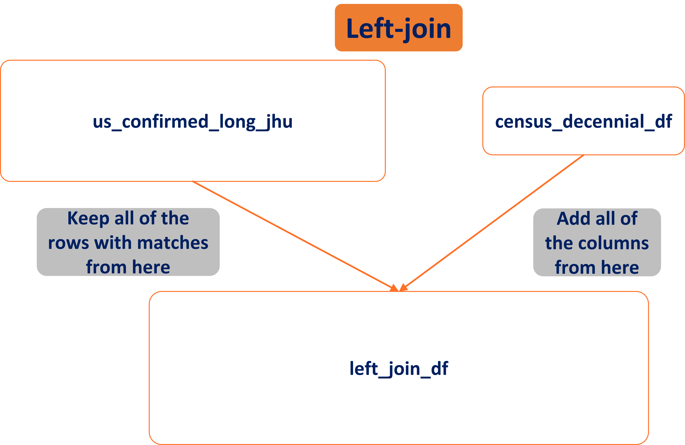
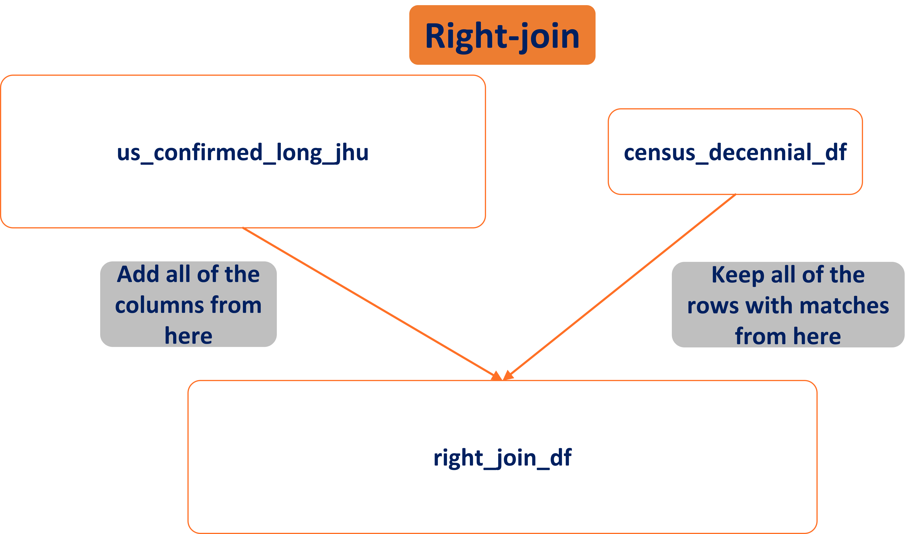
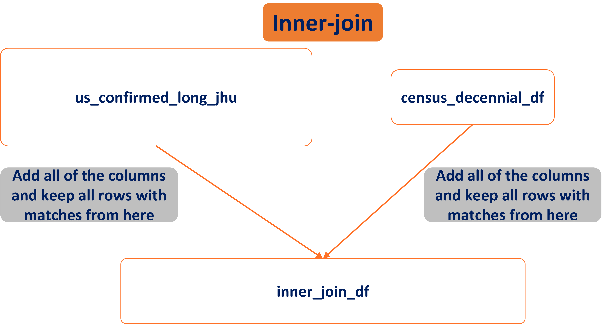
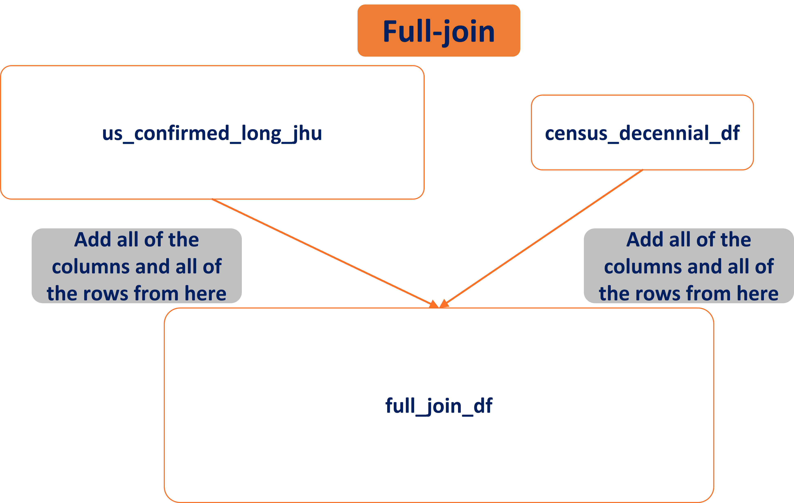

# Set up environment

Clean the environment, clear the workspace and console... etc.

```{r results = FALSE, message = FALSE}
#Clear the workspace
rm(list=ls())

#Clear the console
cat("\014")
```

Always need to read in our packages from their libraries, and set our working directory!

```{r results = FALSE, message = FALSE}
#Include necessary libraries
x = c('rstudioapi',
      'tidyverse',
      'viridis')

# # If you don't know if you've installed the packages for some of these
# # libraries, run this:
# install.packages(x)

lapply(x, library, character.only=TRUE)
rm(x)

#Set working directory (should be universal)
setwd(
  dirname(
    rstudioapi::callFun(
      'getActiveDocumentContext'
    )$path
  )
)
```

<!-- If you end up getting a warning about pdfcrop, you can install it thusly: -->

```{r include = FALSE}
# tinytex::tlmgr_install("pdfcrop")
```

# Aggregate data

We're going back to the COVID-19 Data from Johns Hopkins University (JHU) one last time. We'll hide this now since we're old pros at it.

```{r include = FALSE}
jhu_url = paste("https://raw.githubusercontent.com/CSSEGISandData/",
                "COVID-19/master/csse_covid_19_data/", 
                "csse_covid_19_time_series/",
                "time_series_covid19_confirmed_US.csv", 
                sep = "")

# Read in the data from the site
us_confirmed_long_jhu = read_csv(jhu_url) %>% 
  
  # Rename columns for more informative/pertinent reference
  dplyr::rename(state_name = "Province_State",
                country_region = "Country_Region",
                Long = "Long_",
                county_name = "Admin2",
                county_fips = "FIPS") %>% 
  
  # Reorganize the table to "long" version for merging later, using cases by day
  pivot_longer(!c(UID,
                  iso2,
                  iso3,
                  code3,
                  county_fips,
                  county_name,
                  Combined_Key,
                  state_name,
                  country_region, 
                  Lat, 
                  Long), 
               names_to = "Date", 
               values_to = "cumulative_cases") %>%
  
  # Adjust JHU dates back one day to reflect US time, more or less
  mutate(Date = lubridate::mdy(Date) - lubridate::days(1)) %>% 
  
  # Select only US states, not Canada provinces or any territories
  filter(country_region == "US") %>% 
  
  # Sort the data by state and date
  arrange(state_name, Date) %>% 
  
  # Group the data by county
  group_by(county_fips) %>% 
  
  # Calculate incident cases per day, rather than cumulative count
  mutate(incident_cases = c(0, diff(cumulative_cases))) %>% 
  
  # Ungroup by county for new summarization
  ungroup() %>% 
  
  # Select only columns of interest
  dplyr::select(-c(country_region, Lat, Long)) %>% 
  
  # Ensure no negative incident case records
  mutate(incident_cases = ifelse(incident_cases<0,0,incident_cases)) %>%
  
  # Group by week for summarized data (comment-out for days)
  group_by(week = strftime(Date, format = "%Y-W%V"),
           county_fips) %>% 
  
  # Summarize data by week
  mutate(wk_incident_cases = sum(incident_cases))
```

# Collect Census data

Census data usually requires you to use an API key to access. R has a package in the `tidycensus` library that can take your API key and download census data directly for you. This can be a pain to set up, so we've gone ahead and pre-downloaded the data. It's in the repo for us, so we can plow ahead. We'll just load it here.

The only new thing here is the `st_read` function. This comes from the `sf` package, so we `require()` that here. If you have issues, try `install.packages("sf")`, then `library(sf)`. You should be pretty good at this by now, so hopefully this leaves you feeling good at being able to do stuff! But, if it's tricky or gives you errors, we can help! Don't be afraid to say something here didn't work.

```{r message = FALSE}
require(sf)

census_decennial_df = as_tibble(st_read("./census_data/uscensus_2010decennial_countylevel.shp")) %>%
  dplyr::rename(county_fips = "cnty_fp")
```

# Merge data

Okay, time to actually merge. We'll do four kinds of merges -- or joins: left-join, right-join, inner-join, and full-join.

First, lets do the left-join.

```{r}
## Left-join: join matching values from y, to x.
left_join_df = left_join(x = us_confirmed_long_jhu,
                         y = census_decennial_df)
left_join_df
```

Cool! Merge completed! We've just merged the Census Data to the COVID-19 Data by finding all matching rows from the Census Data in the COVID-19 Data, and keeping all columns from both datasets.



We didn't even need to tell it how to join the datasets, the function knew it automatically. This is because we `rename()`d the column "cnty_fp" from `census_decennial_df` as "county_fips" in the previous code chunk. This column name also appears in `us_confirmed_long_jhu`, so the function matched on common column names by default. This is good practice.

Let's try it the other way around.

```{r}
# Right-join: join matching values from x, to y.
right_join_df = right_join(x = us_confirmed_long_jhu,
                           y = census_decennial_df)
right_join_df
```

So far so good! Now we've merged the Census Data to the COVID-19 Data by finding all matching rows from the COVID-19 Data in the Census Data, and keeping all columns from both datasets.



What if we only wanted matches from **both** sets?

```{r}
# Inner-join: only retain rows with matches from x and y.
inner_join_df = inner_join(x = us_confirmed_long_jhu,
                           y = census_decennial_df)
inner_join_df
```

Still rolling. Now we've merged the Census Data to the COVID-19 Data by finding all matching rows from both datasets and keeping all columns from both datasets. This is the smallest dataset.



Let's try and get the whole join in one.

```{r}
# Full-join: retain all rows from x and y.
full_join_df = full_join(x = us_confirmed_long_jhu,
                         y = census_decennial_df)
full_join_df
```

Nailed it! This is all the data from both sets, the largest possible dataset.



Let's look at the dimensions of the datasets to convince ourselves of what we've done.

```{r}
dim(us_confirmed_long_jhu)
dim(census_decennial_df)
dim(left_join_df)
dim(right_join_df)
dim(inner_join_df)
dim(full_join_df)
```

We can see the left-join is the same row-size as the COVID-19 data we're mergin to. We can see the column numbers increase by the sum of the two column numbers from each dataset, minus one for the matched column (`county_fips`). We can see the sizes match our expectations! Very nice.